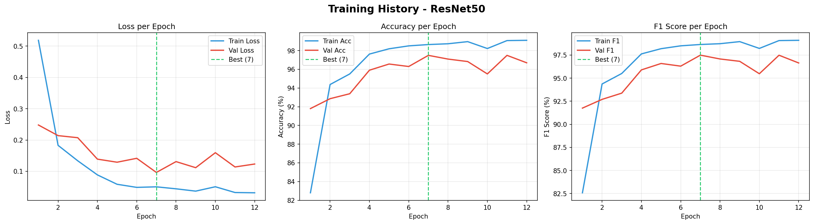
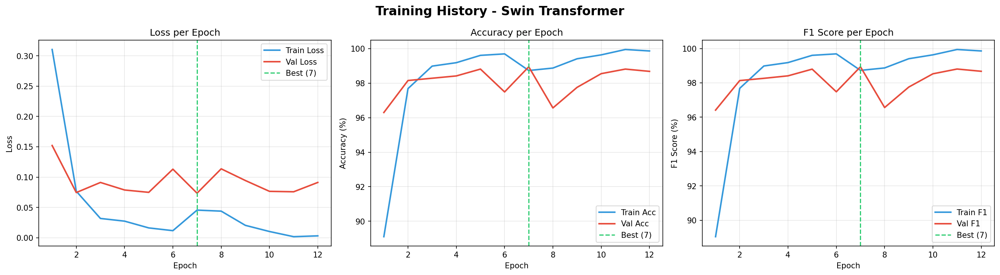
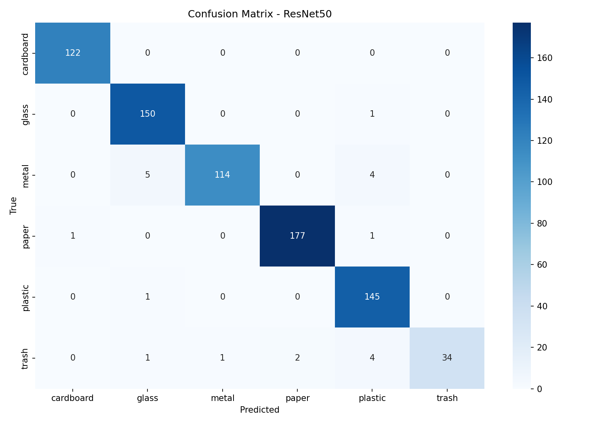
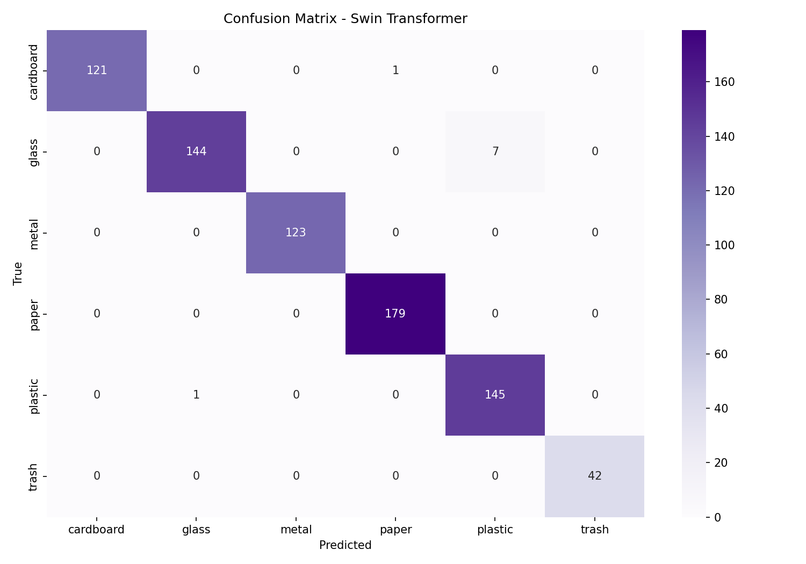
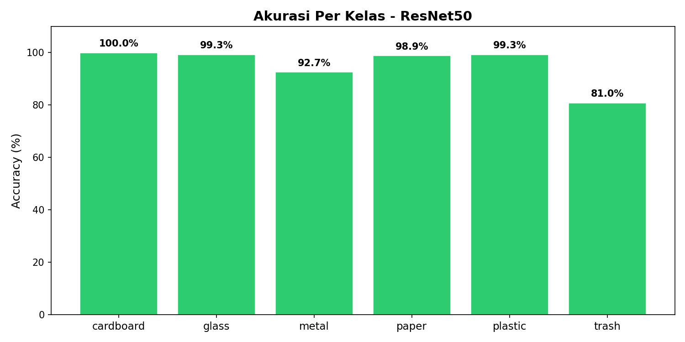
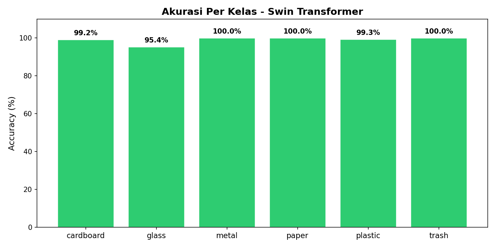
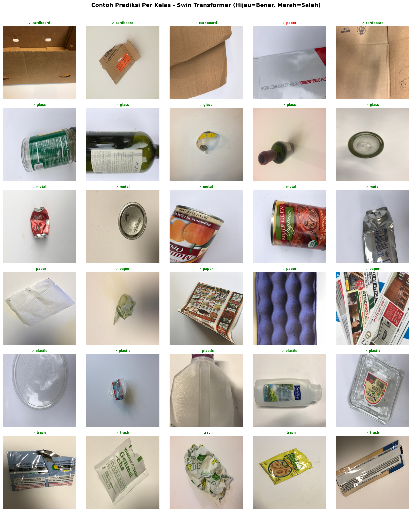

<!--
  README ini di-generate otomatis oleh generate_readme.py
  Jangan edit manual — perubahan akan tertimpa saat pipeline berikutnya.
-->

<div align="center">

# 🗑️ Trashnet Image Classification

**Klasifikasi sampah otomatis dengan deep learning**

[](https://github.com/zzazzz/trashnet/actions)
[](https://www.kaggle.com/code/ziyadmuhammad/trashnet-training)
[](https://huggingface.co/ziyadazz)
[](https://wandb.ai/ziyad-azzufari/trashnet-classification)

> 🤖 Auto-generated report &nbsp;·&nbsp; Last updated: **2026-03-19 15:25 UTC**

</div>

---

## 🏆 Hasil Terbaik

<div align="center">

| | |
|:---:|:---:|
| **🥇 Best Model** | **Swin Transformer** |
| **F1 Score** | **98.82%** |
| **Accuracy** | **98.82%** |

</div>

> Swin Transformer unggul **1.62% F1** dan **1.57% accuracy** dibanding ResNet50 pada test set yang sama.

---

## 📊 Perbandingan Model

| Metric | ResNet50 | Swin Transformer | Winner |
|--------|:--------:|:----------------:|:------:|
| Accuracy   | `97.25%` ██████████ | `98.82%` ██████████ | Swin 🏆 |
| F1 Score   | `97.20%` ██████████ | `98.82%` ██████████ | Swin 🏆 |
| Precision  | `97.35%` ██████████ | `98.85%` ██████████ | Swin 🏆 |
| Recall     | `97.25%` ██████████ | `98.82%` ██████████ | Swin 🏆 |
| Best Epoch | `8` | `6` | — |
| GPU        | `GPU P100` | `GPU P100` | — |

---

## 🧠 Detail Model

### 🔵 ResNet50

> CNN klasik dengan residual connections dari Microsoft Research (2015).
> Proven, cepat, efisien — cocok sebagai baseline yang kuat.

| Metric | Value |
|--------|-------|
| ✅ Accuracy   | `97.25%` |
| 🎯 F1 Score   | `97.20%` |
| 🔍 Precision  | `97.35%` |
| 🔁 Recall     | `97.25%` |
| 📈 Best Epoch | `8` |
| 🖥️ GPU        | `GPU P100` |

🤗 **Model:** [ziyadazz/trashnet-resnet50](https://huggingface.co/ziyadazz/trashnet-resnet50)

---

### 🟣 Swin Transformer

> Vision Transformer berbasis Shifted Window dari Microsoft Research (2021).
> Menangkap global context antar patch gambar — ideal untuk klasifikasi detail tinggi.

| Metric | Value |
|--------|-------|
| ✅ Accuracy   | `98.82%` |
| 🎯 F1 Score   | `98.82%` |
| 🔍 Precision  | `98.85%` |
| 🔁 Recall     | `98.82%` |
| 📈 Best Epoch | `6` |
| 🖥️ GPU        | `GPU P100` |

🤗 **Model:** [ziyadazz/trashnet-swin](https://huggingface.co/ziyadazz/trashnet-swin)

---

## 🖼️ Visualisasi

### 📉 Training History

| ResNet50 | Swin Transformer |
|:--------:|:----------------:|
|  |  |

> Garis hijau putus-putus menunjukkan epoch terbaik (best model checkpoint).

### Confusion Matrix

| ResNet50 | Swin Transformer |
|:--------:|:----------------:|
|  |  |

### Akurasi Per Kelas

| ResNet50 | Swin Transformer |
|:--------:|:----------------:|
|  |  |

### Sample Per Kelas

| ResNet50 | Swin Transformer |
|:--------:|:----------------:|
|  |  |

### Prediksi Benar vs Salah

| ResNet50 | Swin Transformer |
|:--------:|:----------------:|
|  |  |

---

## 🗂️ Dataset

Dataset berbasis [TrashNet](https://github.com/garythung/trashnet) — 6 kategori sampah.

| Split | Jumlah | Keterangan |
|-------|:------:|------------|
| `train/` | ~3.535 | Untuk training model |
| `val/`   | ~756   | Untuk validasi saat training |
| `test/`  | ~763   | Evaluasi akhir (tidak dilihat saat training) |

**Kelas:** `cardboard` · `glass` · `metal` · `paper` · `plastic` · `trash`

---

## 🔄 CI/CD Pipeline

Pipeline berjalan otomatis setiap push ke `main`:

```
Push ke main
      │
      ▼
┌─────────────────────────────┐
│  Upload ke Kaggle Dataset   │
│  • trashnet-training-script │
│  • trashnet-data            │
└────────────┬────────────────┘
             │ tunggu dataset ready
             ▼
┌─────────────────────────────┐
│   Trigger Kaggle Notebook   │
│         (GPU P100)          │
│                             │
│  ① Training ResNet50        │
│  ② Training Swin            │
│  ③ Validasi ResNet50        │
│  ④ Validasi Swin            │
└────────────┬────────────────┘
             │
             ▼
┌─────────────────────────────┐
│  Download output Kaggle     │
│  • metrics_*.json           │
│  • *.png visualisasi        │
└────────────┬────────────────┘
             │
             ▼
┌─────────────────────────────┐
│  Generate README otomatis   │
│  Commit → push ke GitHub    │
└─────────────────────────────┘
```

---

## 📁 Project Structure

```
trashnet/
├── .github/
│   └── workflows/
│       └── ci-cd-pipeline.yml   ← Pipeline utama
├── kaggle_notebook/
│   ├── kernel.py                ← Script yang dijalankan di Kaggle
│   └── kernel-metadata.json    ← Konfigurasi notebook Kaggle
├── results/                     ← Output visualisasi (auto-generated)
│   ├── confusion_matrix_resnet.png
│   ├── confusion_matrix_swin.png
│   ├── training_history_resnet.png
│   ├── training_history_swin.png
│   ├── accuracy_per_class_resnet.png
│   ├── accuracy_per_class_swin.png
│   ├── sample_per_class_resnet.png
│   ├── sample_per_class_swin.png
│   ├── prediction_results_resnet.png
│   └── prediction_results_swin.png
├── model_training_resnet.py     ← Training ResNet50
├── model_training_swin.py       ← Training Swin Transformer
├── validate_model_resnet.py     ← Evaluasi ResNet50
├── validate_model_swin.py       ← Evaluasi Swin Transformer
├── generate_readme.py           ← Generator README ini
├── requirements.txt
└── README.md                    ← File ini (auto-generated)
```

---

## ⚙️ Setup Lokal

```bash
# Clone repo
git clone https://github.com/zzazzz/trashnet.git
cd trashnet

# Install dependencies
pip install -r requirements.txt

# Training
python model_training_resnet.py
python model_training_swin.py

# Evaluasi
python validate_model_resnet.py
python validate_model_swin.py
```

---

## 📦 Requirements

| Package | Keterangan |
|---------|------------|
| `torch` + `torchvision` | Deep learning framework |
| `transformers==4.40.0` | Swin Transformer |
| `datasets` | Load dataset imagefolder |
| `wandb` | Experiment tracking |
| `huggingface_hub` | Upload model ke HF Hub |
| `scikit-learn` | Metrics evaluasi |
| `seaborn` + `matplotlib` | Visualisasi |
| `Pillow` | Image processing |

---

<div align="center">

Created by Ziyad &nbsp;·&nbsp; Auto-updated by CI/CD &nbsp;·&nbsp; [View on WandB](https://wandb.ai/ziyad-azzufari/trashnet-classification)

</div>
